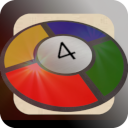

 Senso game
==============

This project implements a small Senso game (aka Simon or others).

* * <em>Start a session in browser on http://tlimbach.github.io/senso/www </em>
* <em>Android APK available for install</em>  https://github.com/OMerkel/senso/releases
* <em>runs in various browsers on</em>
    * <em>desktop systems like BSDs, Linux, Win, MacOS and</em>
    * <em>mobile platforms like Android, FirefoxOS, iOS.</em>

__Keywords, Categories__ _Solitaire, Single Player, Games/Entertainment, Mobile, JavaScript, ECMAScript_

# Abstract

A classical game of listen and reproduce a sequence of tones and lights in correct order. The game is a good training for the player's short-term memory skills.

# Legal

See LICENSE file included in this repository for more details.

_All logos, brands and trademarks mentioned belong to their respective owners._
